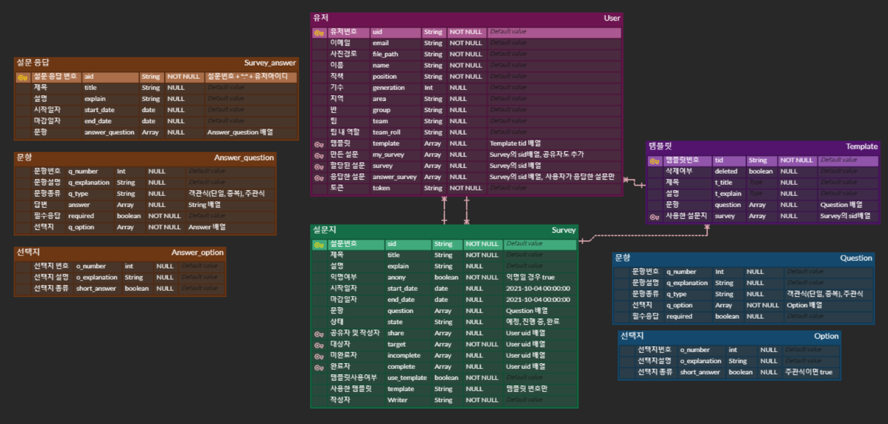

# SSAFY PJT III SSAvey

## 목차

- [프로젝트 소개](#프로젝트-소개)
- [프로젝트 명세](#프로젝트-명세)
  - [개발 환경](#개발-환경)
  - [핵심 라이브러리](#핵심-라이브러리)
     

## 프로젝트 소개

- 서비스명 : SSAvey
- 소재 : 설문조사
- 싸피인을 위한 설문조사 사이트
  1. Mattermost로 설문 관련 알림을 보내고 받을 수 있습니다.
  2. 설문 응답 후 자신이 응답한 내용을 확인할 수 있습니다.
  3. 설문 결과를 시각화하여 직관적으로 결과를 확인할 수 있습니다.
  4. 이전에 진행한 설문과 비교한 결과를 확인할 수 있습니다.
  5. 설문 결과를 엑셀 파일로 추출할 수 있습니다.
      

## UCC
https://youtu.be/lrKpjAwndXk
## ERD

## 와이어프레임
https://www.figma.com/file/SualqBiW79snBswJf9SQzW/SSAvey?node-id=0%3A1

## 기능명세
https://descriptive-palm-574.notion.site/c8c8517ce7b94d5eae389b5740bbed6d?v=95139dc240e3413cac31bc9280d97952

## API
https://descriptive-palm-574.notion.site/9ed44a710e35471594e30e582b14cb32?v=79c3ef977dd3445c81018900cfe00749

## 프로젝트 명세

### 개발 환경

---
## :video_game: 기술 스택

### 💻Back-End

    
Back 자세히 살펴보기 🔥

    <ul>
      <li>기술스택 ⚙</li>
    </ul>
    <ul>
        <li>Spring-Boot : 2.3.9</li>
        <li>Spring-Data-MongoDB</li>
        <li>spring-boot-starter-validation</li>
        <li>spring-boot-starter-jdbc</li>
        <li>spring-cloud-starter-aws : 2.2.5</li>
        <li>lombok</li>
        <li>mongoDB</li>
    </ul>

### ✨Front-End / Android

- **지원 환경** : Web / Mobile 

    
Front 자세히 살펴보기 🌈

    <ul>
        <li>기술스택 ⚙</li>
    </ul>   
    <ul>
        <li>JS, HTML, CSS</li>
        <li>SCSS</li>
        <li>vue/cli 4.5.13</li>
        <li>vue 2.6.10</li>
    </ul>
    <li>--------------------------------------------------------------------------------------</li>
    <ul>
        <li>라이브러리 📚</li>
    </ul>   
    <ul>
        <li>axios</li>
        <li>eslint & prettier</li>
        <li>node-sass</li>
        <li>sass-loader</li>
        <li>aos</li>
        <li>bootstrap</li>
        <li>bootstrap-vue</li>
        <li>jwt-decode</li>
        <li>less-loader</li>
        <li>v-calendar</li>
        <li>vue-compare-image</li>
        <li>vue-easy-range-date-picker</li>
        <li>vue-infinite-loading</li>   
        <li>vue-typer</li>
        <li>vue2-datepicker</li>
        <li>vue2-daterange-picker</li>
        <li>vuejs-countdown</li>
        <li>vuelendar</li>
        <li>vuelidate</li>
        <li>vuex</li>
        <li>vuex-persistedstate</li>
    </ul>

### 🌏Infra

  

      
개발, CI/CD 자세히 살펴보기 🔥

      <ul>
          <li>AWS-EC2</li>
          <li>Jenkins</li>
          <li>Docker</li>
      </ul>
  

---

#### Design

- **Framework 사용** : O 
  - [Vuetify](https://vuetifyjs.com/)
  - [Sass](https://sass-lang.com/)
  - [BootstrapVue](https://bootstrap-vue.org/)
  - [AntDesign of Vue](https://antdv.com/docs/vue/introduce-cn/)
- **Design Tool 사용** : 
- **담당자** : 김대호, 민찬우
   

---
### 핵심 라이브러리

- **Mattermost API**
  - **링크** : https://api.mattermost.com/
  - **소개** : Mattermost에서 제공하는 API
  - **사용 기능** : 로그인, Post, 채널 기능 이용

